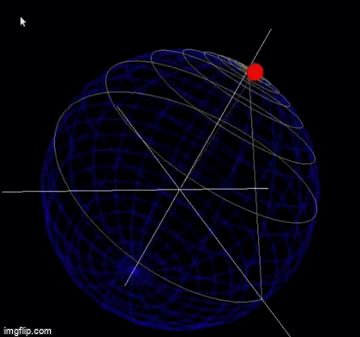

## Task 1
**Team Members:** 
**Remon Alber** 
**Rawan Sayed Badr** 
**Sara Adel** 
**Mohamed El-Moatasem** 

## Welcome to our GUI
  
**Step 1: Uploading Image**  
  
**Step 2: you can get FT-(Magnitude/Phase/Real/Imaginary) from Combobox next to Image**  
  
**Graph Button for Showing Non-Uniformity of Magnetic Field 1.5 Tesla**  
  

## Out Trajectory
  
  
  
  
  
