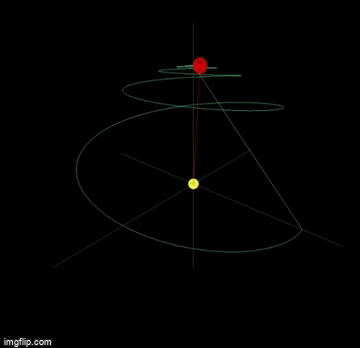
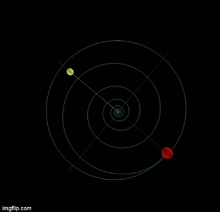
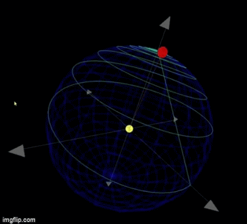
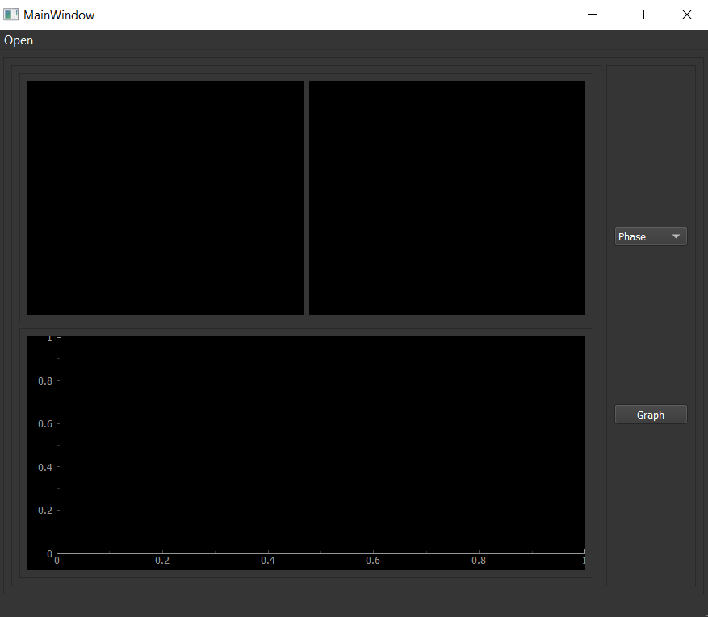
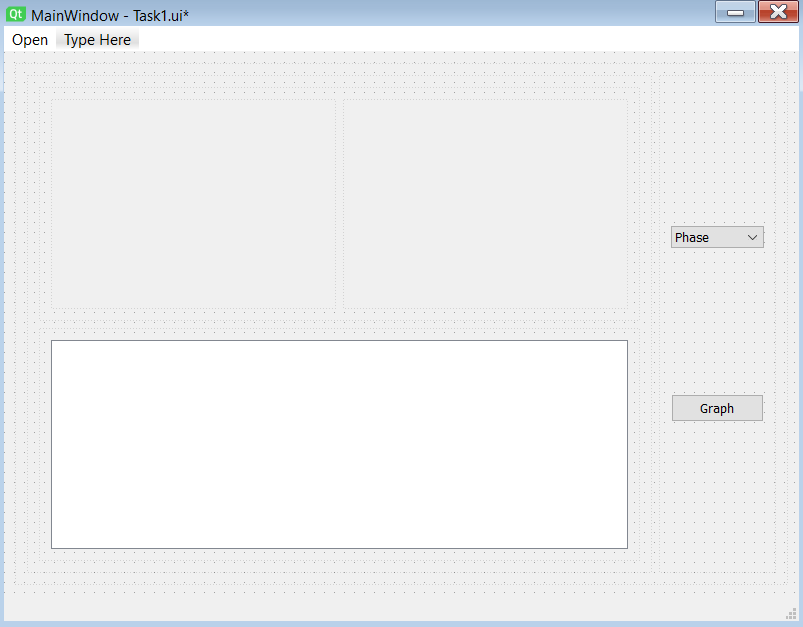
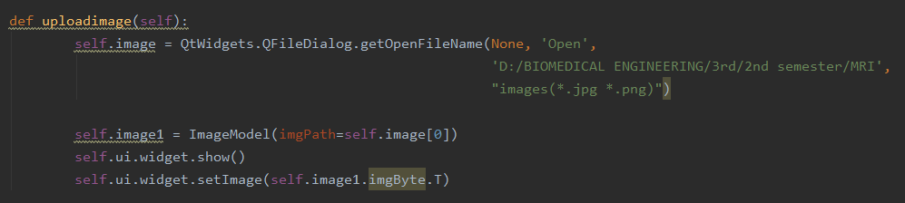

## MRI_Task 1
**Team Members:** 
**Remon Alber** 
**Rawan Sayed Badr** 
**Sara Adel** 
**Mohamed El-Moatasem** 

## Part One
**- Create a function that rotates the bulk magnetization vector.**  
**- Plot the bulk magnetization's trajectory and generate a figure representing the results.**  
## Bulk Magnetization's Trajectory
  
  
  
  
  
## Summary about our part one implementation 

## Part Two 
**- Load images; show the figures. Calculate the Fourier transform of the images and plot it in the K-space domain.**  
**- Define a function that simulates the non-uniformity effect; where its effect is imposed in the axial (z), but no radial (x or y)  dependence on the magnetic field strength. Make a plot of Bz(z).**  
## Welcome to our GUI
  
**Step 1: Uploading Image**  
  
**Step 2: you can get FT-(Magnitude/Phase/Real/Imaginary) from Combobox next to Image**  
  
**Graph Button for Showing Non-Uniformity of Magnetic Field 1.5 Tesla**  
  
## Summary about our part two implementation 
**We use QT-Designer to create the above GUI.**  
  
**Then we implement Functions of**  
***Uploading image***  
  
***Getting Fourier Transform***  
  
***Graph Non-Uniformity of Magnetic Field 1.5 Tesla***  
  

## Some Instructions to be able to run our Code
**[Install PyQt5](https://pypi.org/project/PyQt5/)**   
**[Install OpenGl](https://download.cnet.com/Apple-OpenGL/3000-2070_4-395.html)**
