## MRI_Task 1
**Team Members:**<br/>
**Remon Alber**<br/>
**Rawan Sayed**<br/>
**Sara Adel**<br/>
**Mohammed Almotasem**<br/>

## Part One
### Task Statment
**- Create a function that rotates the bulk magnetization vector.** <br/>
**- Plot the bulk magnetization's trajectory and generate a figure representing the results.** <br/>
## Bulk Magnetization's Trajectory
### Using OpenGl
**Case 1** <br/>
* Parameters:
* Angle=90.
* T1=500.
* T2=200.
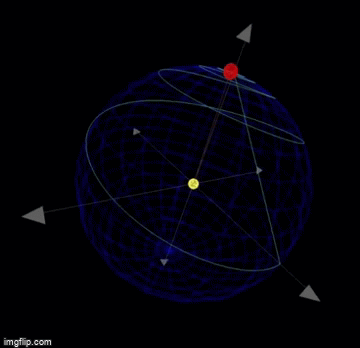 <br/>
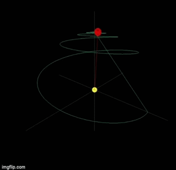 <br/>
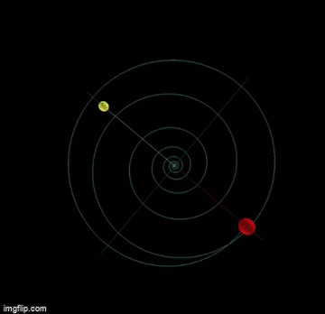 <br/>
**Case 2** <br/>
* Parameters:
* Angle=90.
* T1=1000.
* T2=500.
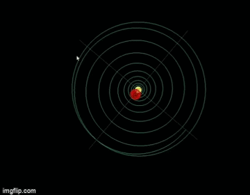 <br/>
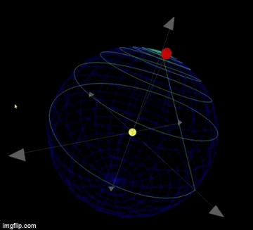 <br/>
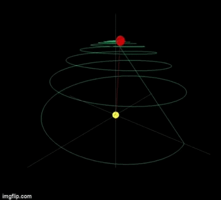 <br/>
**Case 3** <br/>
* Parameters:
* Angle=75.
* T1=500.
* T2=200.
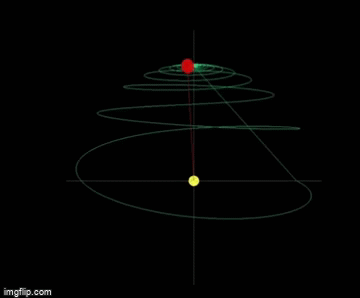 <br/>
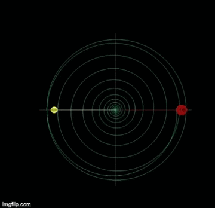 <br/>
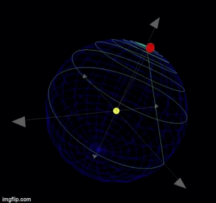 <br/>
### Using Python

## Summary about our part one implementation 
**We used the Bloch equations as instructed to implemnet the function that could simulate the behaviour of the magnetization vector. In our simulation the magnetization vector is represented in a red line and it's compomnent in the XY-plane is in yellow line.** <br/>
**When an RF pulse is given, Our vector rotates to the XY-plane by the given rotating angle while maintaining it's precission, when the pulse is removed the vector is tends to return to it's original directon, So it takes the Helix-path represented by the gray spiral, making the magnetization z component increases by a rate equal to: ``` Mz = Mo(1-exp(-time/T1))```** <br/>
**While that Our XY component ddecays in magnitude by a rate equal to: ``` Mxy = Mo * exp(-time/T2)```** <br/>
## Part Two 
### Task Statment
**- Load images; show the figures. Calculate the Fourier transform of the images and plot it in the K-space domain.** <br/>
**- Define a function that simulates the non-uniformity effect; where its effect is imposed in the axial (z), but no radial (x or y)  dependence on the magnetic field strength. Make a plot of Bz(z).** <br/>
## Welcome to our GUI
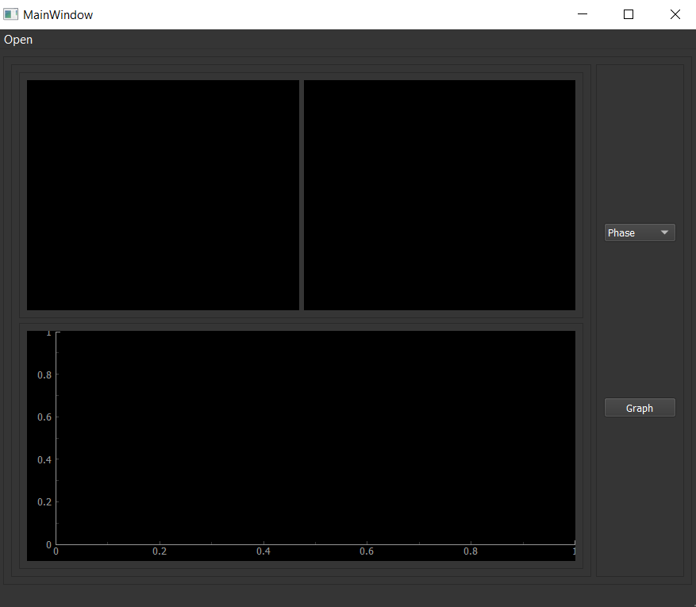 <br/>
**Step 1: Uploading Image** <br/>
 <br/>
**Step 2: you can get FT-(Magnitude/Phase/Real/Imaginary) from Combobox next to Image** <br/>
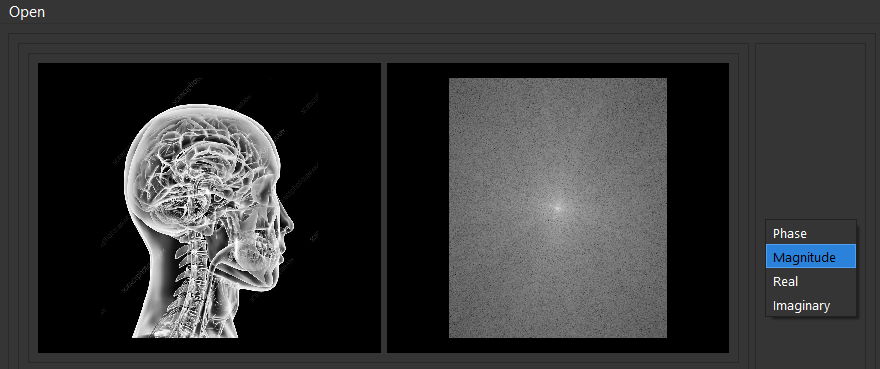 <br/>
**Graph Button for Showing Non-Uniformity of Magnetic Field 1.5 Tesla** <br/>
 <br/>
## Summary about our part two implementation 
**We used the fourier functions supported by the Scipy library to seperate the components of a given picture and display any one of them according to the choice of the user.** <br/>
**We use QT-Designer to create the above GUI.** <br/>
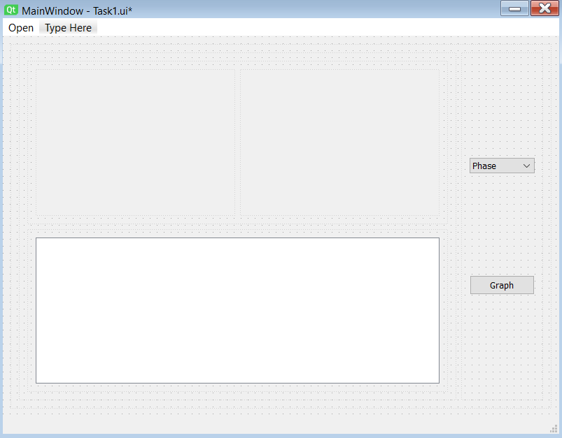 <br/>
**Then we implement Functions of:** <br/>
***1-Uploading image*** <br/>
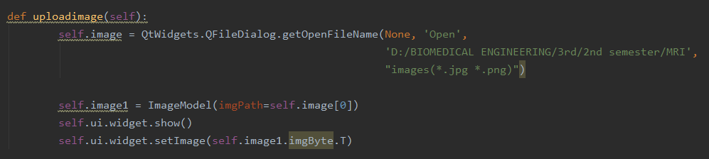 <br/>
***2-Getting Fourier Transform*** <br/>
 <br/>
***3-Graph the non-uniformity effect of Magnetic Field 1.5 Tesla*** <br/>
 <br/>

## Some Instructions to be able to run our Code
**[Install PyQt5](https://pypi.org/project/PyQt5/)**  <br/>
**[Install OpenGl](https://download.cnet.com/Apple-OpenGL/3000-2070_4-395.html)**
